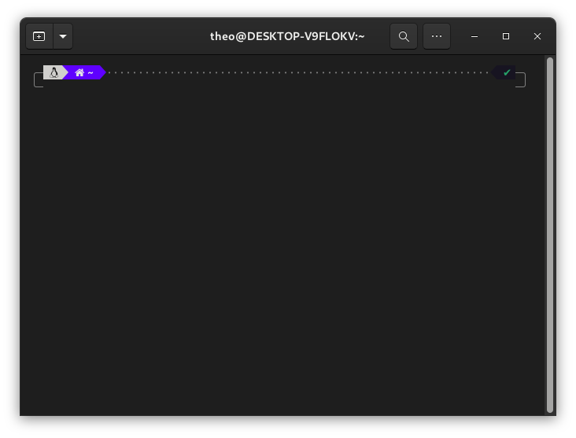

# Git

**Outil de collaboration**

Louvain-li-Nux


---

## Cette présentation est

- Sous license libre CC-BY 4.0
- Disponilbe en ligne: <https://wiki.louvainlinux.org/fr/training/git>

---

## Table des matières

<!-- TODO -->

---

## Git, c'est quoi ?


---

### Git, c'est quoi ?

- C'est un système de gestion de versions distribué
- VCS, en Anglais

---

## Environment Setup

---

### Linux

```sh
sudo apt update; sudo apt install git
```

### Windows

`Ctrl + R` $\rightarrow$ `powershell` $\rightarrow$ `wsl --install` $\rightarrow$ cf. Linux

### Mac

```sh
/bin/bash -c "$(curl -fsSL https://raw.githubusercontent.com/Homebrew/install/HEAD/install.sh)"
```

---

## The Shell

Quelques explications sur l'interface commande

---

### Le Terminal



---

### La Commande

```sh
$ echo "Hello world"  # <-- commande
Hello world           # <-- sortie
```


---

- `cd` = Changer de dossier
- `ls` = lister le dossier
- `echo` = écrire du text
- `cat` = lire un fichier

---

### Le Chemin

```txt
/home/[username]/projets/git/
```

---

### Configurer `git`

```sh
git config --global user.name Theo
git config --global user.email theo@louvainlinux.org
```
