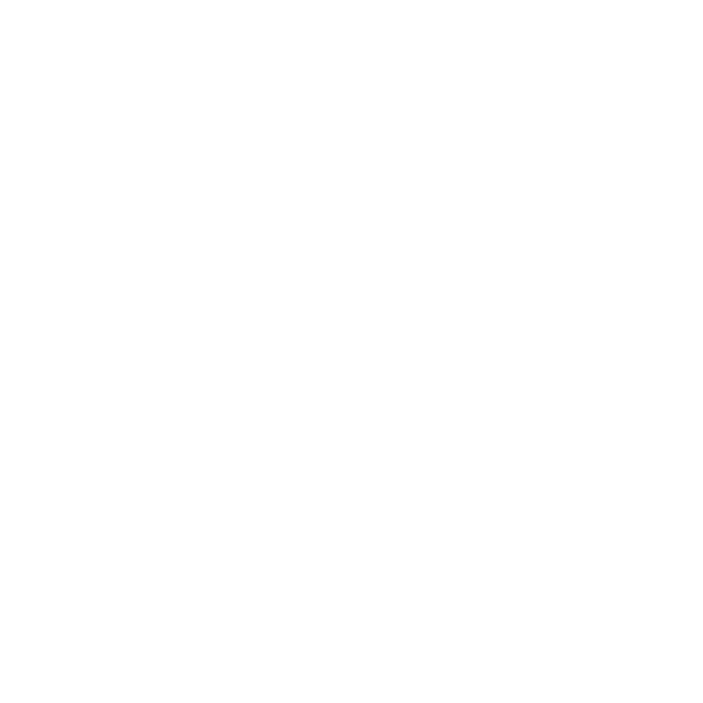

<style>
	kbd {
		font-size: 0.7em;
		line-height: 1.2em;
	}
</style>

# Git

**Outil de collaboration**

Louvain-li-Nux


---

## Cette présentation est

- Sous license libre GPLv2
- Disponible en ligne : <https://git.louvainlinux.org>
- N'hésitez pas à suivre les slides en même temps que la presentation !

---

## Git, c'est quoi ?

- Un système de gestion de versions distribué.
- VCS (Version Control System), en Anglais.

---

## Mise en place de l'environnement

---

Ouvrir votre émulateur de terminal ("Terminal" sur Windows), et ensuite :

### Linux (<kbd>Ctrl</kbd><kbd>Shift</kbd><kbd>C</kbd>, <kbd>Ctrl</kbd><kbd>Shift</kbd><kbd>V</kbd>)

```sh
$ sudo apt update && sudo apt install git
```

### Windows (<kbd>Ctrl</kbd><kbd>Shift</kbd><kbd>C</kbd>, <kbd>Ctrl</kbd><kbd>Shift</kbd><kbd>V</kbd>)

- `wsl --install`
- Ouvrir une session Linux.
- Cf. Linux.

### Mac (<kbd>⌘</kbd><kbd>C</kbd>, <kbd>⌘</kbd><kbd>V</kbd>)

```sh
$ /bin/bash -c "$(curl -fsSL https://raw.githubusercontent.com/Homebrew/install/HEAD/install.sh)" && brew install git
```

---

## WSL

- Utilisez absolument le "Windows Terminal" ! (Les autres invites de commande sur Windows sont vraiment pourries.)
- Dans votre session Linux, vous pouvez taper `explorer.exe .` pour ouvrir le dossier contenant vos fichiers sur Linux.

---

## La ligne de commande (CLI)

Des implémentations GUI existent, *mais* :

- Moins flexibles.
- Opaques.
- Souvent fermées.
- C'est juste plus facile de tous vous apprendre la même chose.

Donc $\rightarrow$ petit détour vers les bases du CLI !

---

## La Commande

```sh
$ echo "Hello world"  # <-- commande + argument
Hello world           # <-- sortie
```


---

## Le Chemin (aka Path)

Soyez attentif ici, c'est là où les gens ont généralement le plus de mal !

---

## Le Chemin (aka Path)

Une liste de dossiers empruntés pour arriver à un dossier/fichier, séparés par des `/`
E.g. :

- Un fichier qui s'appelle "tux" : `tux`
- Ce dossier "super" : `super`
- Un fichier qui s'appelle "tux2" dans ce dossier "super" : `super/tux2`

Ce sont des chemins *relatifs* !

---

### `pwd`

**Q**: Relatifs à quoi ? **R**: Relatifs à nous.
**Q**: Comment savoir où nous sommes ? **R**:

```sh
$ pwd # "print working directory" ou "écrire le dossier de travail"
/home/beastie
```

Le "dossier de travail" ou "working directory" est le dossier dans lequel nous sommes actuellement.
Ceci est un chemin *absolu* !

---

### `pwd`

On peut trouver un chemin absolu d'un chemin relatif en ajoutant notre dossier de travail avant :

- Le fichier `tux` devient `/home/beastie/tux`
- Le dossier `super` devient `/home/beastie/super`
- Le fichier `super/tux2` devient `/home/beastie/super/tux2`

---

### `ls`

On peut afficher tous les fichiers/dossiers dans notre dossier de travail :

```sh
$ ls
tux	super/
```

Ou dans un autre dossier :

```sh
$ ls super
tux2
```

---

### `cd`

On peut changer notre dossier de travail :

```sh
$ cd super
```

Et puis encore :

```sh
$ ls
tux2
```

---

### `cd`

On peut retourner un dossier en arrière :

```sh
$ pwd
/home/beastie/super
$ cd ..
$ pwd
/home/beastie
```

---

### Recap

- `pwd` : Afficher le dossier de travail.
- `ls` : Afficher le contenu d'un dossier.
- `cd` : Changer le dossier de travail.

---

## Concepts de base de git

---

### Le repo ("dépôt" en 🇫🇷)

- Endroit où notre code est stocké, ainsi que l'historique des versions et toutes les données relatives à `git`.
- Généralement, un projet == un repo.

---

### Le remote

- Emplacement distant qui sert de "source de vérité" à notre repo.
- Souvent sur un serveur externe (GitHub, Gitlab, etc.).
- Récupérer un repo c'est "clôner" un repo.


---

### Plusieurs remotes

C'est aussi possible d'avoir plusieurs remotes à la fois !
On verra l'utilité de celà un peu plus tard...



---

### Configuration de pour la suite de cet atelier git

```sh
git config --global user.name "Tux"
git config --global user.email "info@louvainlinux.org"
git config --global pull.rebase false
git config --global push.autoSetupRemote true
```

---

Clôner votre repo :

```sh
$ git clone https://git.louvainlinux.org/repo-69
```

Un dossier a été crée, `cd` dedans :

```sh
$ cd repo-69
$ pwd
/home/tux/repo-69
```

---

## Le stage (~ scène)

Espace de travail pour des changements.


---

### Diff (unstaged)

On peut voir les changements qui ne sont pas encore sur le stage ("unstaged") :

```sh
$ git diff
```

Dans ce cas ci, tous les changements sont unstaged.


---

### Ajout de changements

On peut faire monter des changements sur le stage :

```sh
$ git add chemin/vers/mon/fichier
```


---

### Diff (staged)

On peut voir les changements sont sur le stage ("staged") :

```sh
$ git diff --staged
```


---

### Nettoyage du stage

On peut tout enlever du stage :

```sh
$ git reset
```

Et du coup il n'y a plus rien de staged.


---

### Effaçage des changements

On peut tout enlever du stage et en dehors du stage :

```sh
$ git restore chemin/vers/mon/fichier
```


---

### Statut global du stage

On peut voir le statut global du stage :

```sh
$ git status
On branch main
Your branch is up to date with 'origin/main'.

Changes to be committed:
  (use "git restore --staged <file>..." to unstage)
	modified:   fichier-modifié-et-staged

Changes not staged for commit:
  (use "git add <file>..." to update what will be committed)
  (use "git restore <file>..." to discard changes in working directory)
	modified:   fichier-modifié-mais-pas-stageed

Untracked files:
  (use "git add <file>..." to include in what will be committed)
	nouveau-fichier

no changes added to commit (use "git add" and/or "git commit -a")
```

---

## Mais que fait-on avec le stage ?

---

### Le commit

- Un peu comme une photo de ce qu'il y a sur le stage avec un petit message.
- (Normalement) immuable.
- Représente une unité de changement.
- Exemple de commit avec comme message "ui: Add random button" :

```sh
$ git commit -m "ui: Add random button"
```


---

### Le log

- Au final, notre code est une superposition de ces changements (commits) en ordre chronologique.
- Un peu comme un album photo.
- On peut voir toutes les photos de cet "album photo" :

```sh
$ git log
commit 3e54... (HEAD -> main, origin/main, origin/HEAD)
Author: Tux <info@louvainlinux.org>
Date:   Thu Feb 29 14:06:18 2024 +0100

    Dernier commit

commit de92ddfcc4f6c9e06dfc148f681e35aeca32ac01
Author: Tux <info@louvainlinux.org>
Date:   Thu Feb 29 14:05:25 2024 +0100

    Premier commit
```

---

### Le push

Le fait de mettre à jour le remote avec nos changements :

```sh
$ git push
```


---

### Le pull

Le fait de nous mettre à jour par rapport au changements sur le remote :

```sh
$ git pull
```


---

### Recap

- Stage : Endroit où on prépare les changements à être ajoutés à un commit.
- Commit : L'acte de prendre une "photo" des changements sur le stage et mettre un nom dessus.
- Log : La liste de tous les commits.

---

## Un exemple concret !

*Démo en live de ce que je viens d'expliquer.*

---

### Recap

- Stage : Endroit où on prépare les changements à être ajoutés à un commit.
- Commit : L'acte de prendre une "photo" des changements sur le stage et mettre un nom dessus.
- Log : La liste de tous les commits.

---

## Exercices git

Assurez-vous de bien être dans le dossier de votre repo :

```sh
$ pwd
/home/tux/repo-69
```

---

### Exercice 1 : Les bases

- Modifier le fichier `README.md`
- "Stage" les changements : `git add README.md`
- "Commit" les changements : `git commit -m "descriptif de mes changements"`
- "Push" les changements : `git push`

---

## Exercices sur la collaboration

### Merges, conflits, résolutions

---

### Exercice 2 : Changements remote

Passer au prochain exercice en faisant un commit avec "exercice 2" dans le titre :

```sh
$ git commit --allow-empty -m "exercice 2"
$ git push
```

---

### Exercice 2 : Changements remote

*Contexte* : quelqu'un a push des changements après toi.
Essayez de faire un nouveau commit.

---

### Exercice 2 : Changements remote

```sh
$ git push
[main 7c64a36] test
To https://git.louvainlinux.org/repo-69
 ! [rejected]        main -> main (fetch first)
error: failed to push some refs to 'https://git.louvainlinux.org/repo-69'
hint: Updates were rejected because the remote contains work that you do not
hint: have locally. This is usually caused by another repository pushing to
hint: the same ref. If you want to integrate the remote changes, use
hint: 'git pull' before pushing again.
hint: See the 'Note about fast-forwards' in 'git push --help' for details.
```

---

### Exercice 2 : Changements remote

- "Pull" les changements du remote : `git pull`
- Vous verrez un nouveau fichier en faisant `ls`
- Faites un `git log` et vous verrez qu'un commit a été ajouté avant le votre.
- "Push" votre commit et ça marchera : `git push`

---

### Exercice 3 : Conflits de merge

Passer au prochain exercice en faisant un commit avec "exercice 3" dans le titre :

```sh
$ git commit --allow-empty -m "exercice 3"
$ git push
```

---

### Exercice 3 : Conflits de merge

*Contexte* : quelqu'un a push un commit qui a modifié quelque chose qu'un commit à vous a aussi modifié.

---

### Exercice 3 : Conflits de merge

- Changez la première ligne de `README.md` vers ce que vous voulez.
- Committez ce changement.
- "Pull" ces changements du remote :

```sh
$ git pull
Auto-merging README.md
CONFLICT (content): Merge conflict in README.md
Automatic merge failed; fix conflicts and then commit the result.
```

---

### Exercice 3 : Conflits de merge

- Ouvrez `README.md` et gardez ce que vous voulez :

```md
<<<<<<< HEAD
# Mon nouveau titre
=======
# Le titre conflictuel
>>>>>>> main
```

---

### Exercice 3 : Conflits de merge

- Committez la resolution de merge :

```sh
git add README.md
git commit -m "merge: Merge from main"
git push
```

---

## Travail de groupe

Pour cette partie de la presentation, mettez vous en groupes de 2.
Choisissez le repo que vous préférez - vous allez à présent tous les deux travailler dessus.
Assurez-vous d'avoir tous les deux clone ce repo.

```sh
$ git clone https://git.louvainlinux.org/repo-69
```

---

### Exercice 4 : Générer un merge conflict

Faites en sorte qu'il y ait un merge conflict :

- Modifiez tous les deux la même ligne de code.
- Faites tous les deux un commit et essayez de push.
- L'un d'entre vous devra pull et resolver le merge conflict.

Ensuite, inversez les rôles !

---

## Branches

- Permettent que chacun travaille "dans son coin".
- Les choses sont mises en commun tout à la fois plutôt qu'après chaque commit.
- Permettent de tester des changements avant de les faire passer en production.
- La branche principale s'appelle `main`.

---

### Lister les branches

On peut voir une liste des branches :

```sh
$ git branch
* main
  branch2
```

L'étoile indique sur quelle branche on est.

---

### Changer de branche

On peut changer notre branche courante :

```sh
$ git checkout branch2
$ git branch
  main
* branch2
```

---

### Nouvelle branche

On peut créer une nouvelle branche :

```sh
$ git checkout -b branch3
$ git branch
  main
  branch2
* branch3
```

---

### Visualisation des branches

On peut visualiser les branches :

```sh
$ git log --oneline --decorate --graph --all

# C'est un peu trop long pour taper ici,
# regarder plutôt la jolie image à droite.
```


---

### Merge d'une branche

On peut merge d'une branche :

```sh
$ git checkout main
$ git merge branch2
$ git merge branch3
```

Et les éffacer ensuite :

```sh
$ git branch -d branch2
$ git branch -d branch3
```

---

### Branches sur remote

On peut push nos branches pour les utiliser autrepart :

```sh
$ git push
```

---

### Exercice 5 : Branches

- Toujours en groupes de deux.
- Créez chacun une branche.
- Faites quelques commits sur vos branches.
- Push vos changements.
- Pull les changements de l'autre.
- Merge la branche de l'autre (et resolvez les conflits s'il y en a).
- Push le merge.

---

## Étiquette git

---

### Ne pas push des gros blobs binaires

- Git est fait primairement pour du texte.
- Éviter de push des gros fichiers s'ils ne constituent pas la "source" du projet (i.e. si l'utilisateur sait le générer lui-même, ça n'a pas lieu d'être sur git).
- **Exemple** : Push `main.c`, mais pas `main.o`. L'utilisateur sait executer la commande lui-même (`gcc -c main.c -o main.o`), et `main.o` est un gros fichier binaire.

---

### Solution : `.gitignore`

Fichier à la racine du repo qui contient une liste de chemins à ne pas être commit :

```sh
je/veux/surtout/pas/commit/ce/dossier

# "*" veut dire "main.o", mais aussi "dfkjghdkfg.o"
# ou encore "sedidhoi.o"

*.o
```

---

### Avoir le diff le plus petit

- Ne pas modifier des choses qui ne sont pas pertinentes.
- **Exemple** : Changer le formattage d'un fichier auquel on a autrement pas touché, même s'il est incorrect.
- **But** : Avoir le diff le plus petit. Un petit diff est plus facile à review et à "blâmer" (on verra ça plus tard).

---

### Pas de "trailing whitespaces"

- Ne pas laisser des espaces blancs à la fin des lignes.
- `git diff` affichera même en rouge pour pas qu'on passe à côté :


---

### Avoir un newline (`\n`) à la dernière ligne

Sur VS Code, ajouter dans `settings.json` :

```json
{
	"files.insertFinalNewline": true
}
```

Pourquoi ce n'est pas activé par défaut ? Un mystère...
Important car sinon un diff qui ajoute une ligne en modifiera deux, vu qu'il faut aussi ajouter une newline à la précédente.

---

## Contribution à un repo Open Source

Maintenant on va mettre ce que vous avez appris en pratique !

---

### Créer un compte GitHub

- Allez sur <https://github.com>.
- Débrouillez-vous.

---

### Mettre en place les clefs SSH (authentification)

```sh
$ ssh-keygen -t ed25519 -P ""
# Appuyez sur ENTER
$ cat ~/.ssh/id_ed25519.pub
```

Copier la sortie de cette commande.

---

### Ajouter la clef SSH sur GitHub

Une fois dans les paramètres, allez sur "SSH and GPG keys".


---

### Ajouter la clef SSH sur GitHub

Appuyez sur "New SSH key".


---

### Ajouter la clef SSH sur GitHub

Collez votre clef SSH public.
Soyez sûr de bien copier `id_ed25519.pub` et pas `id_ed25519` !


---

### Créer un repo sur git


---


---


---

### Ajouter un second remote

```sh
$ git remote
origin
$ git remote add github ssh://git@github.com/tux/mon-repo
$ git remote
origin
github
$ git push github
```

---

## Un exemple concret !

*Démo en live de ce que je viens d'expliquer.*

---

## Contribuer à un repo Open Source

On va utiliser <https://github.com/firstcontributions/first-contributions>, qui est un projet fait exprès pour introduire les gens aux contributions Open Source.

---

### Fork


---

### Faire ses changements

```sh
$ git clone ssh://git@github.com/tux/first-contributions
$ cd first-contributions
```

Ajoutez votre nom ou ce que vous voulez au fichier `README.md`.

```sh
$ git add README.md
$ git commit -m "mes changements"
$ git push
```

---

### Ouvrir une PR


---

## Un exemple concret !

*Démo en live de ce que je viens d'expliquer.*

---

## Features avancées

- `git add -p`
- Tags.
- Les hooks : <pre-commit.com>.
- `git commit --amend`
- `git blame`
- `git reset HEAD~1`

---

# Merci pour votre attention !

Les slides sont disponibles en ligne :

<https://git.louvainlinux.org>
